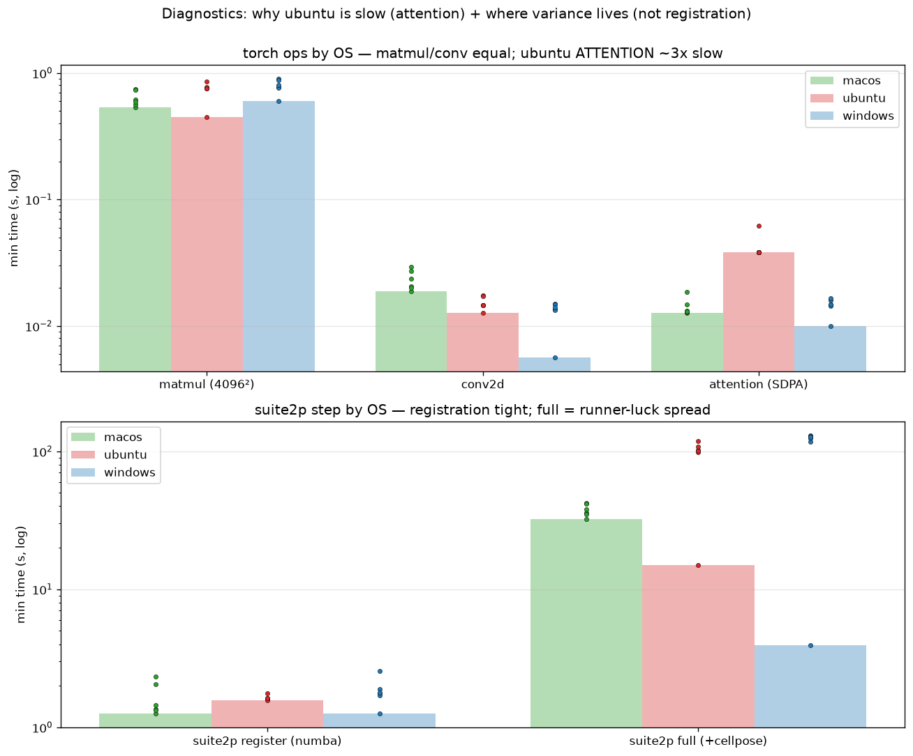

# Diagnostics results — why ubuntu is slow + where the variance lives

_Data: diagnostics run, 18/18 legs green (3 OS × {3.12, 3.14} × 3 runs). Figure
auto-generated by CI (`plot_diag.py`); narrative written by hand._

## Setup

PR #1 (thread-pinning) had already established: pinning is *not* the fix
(pin1 slower everywhere, within-OS variance low), cellpose is stable per-OS, and
two open questions remained. This experiment answers both with torch-internal
probes and a real suite2p step on synthetic data (CPU-forced on every OS).

## A — why is cellpose CPU inference slower on x86? It's **ubuntu**, and it's the **attention kernel**

torch op microbenchmarks (min seconds, best across runs):

| op | macOS | ubuntu | windows |
|---|---|---|---|
| matmul (4096²) | 0.54 | 0.45–0.76 | 0.60–0.76 |
| conv2d | 0.019 | 0.013 | 0.006–0.013 |
| **attention (SDPA)** | **0.013** | **0.038** | **0.010–0.015** |

matmul and conv2d are ~equal across all three OSes → it is **not** BLAS/MKL/oneDNN.
The single outlier: **ubuntu's scaled-dot-product attention is ~3× slower**
(0.038 vs 0.013 s), consistently across both Python versions. cellpose-SAM is a
ViT — attention-dominated — so that one slow kernel accounts for ubuntu's
systematic ~3× cellpose gap.

Build configs (artifact `torch-config-*.txt`) confirm the surprise that it isn't
MKL: **macOS torch has no MKL/oneDNN at all** (just OpenMP) yet is fastest — it's
Apple-Silicon hardware. Both x86 builds *have* MKL+oneDNN; only ubuntu's
attention path is slow.

**Refinement of the cross-OS picture:** Windows is **not** systematically slow —
its ops are all fast; its cellpose ranged 14 s (faster than macOS) to 123 s
purely by runner luck. So: **macOS fast+stable; ubuntu systematically ~3× slow
(attention kernel); Windows fast-but-wildly-variable.**

## B — the variance is **not** registration; it's runner luck on the transformer

suite2p step (min seconds, dots in the figure = each run):

| stage | macOS | ubuntu | windows |
|---|---|---|---|
| register (numba) | 1.25 | 1.57 | 1.26–1.70 |
| full (+cellpose) | 32–36 | 15–98 | 3.9–124 |

**Registration is tight and ~equal everywhere** (1.3–1.7 s) → the historical 5×
same-leg blow-up is **not** the numba registration stage. The full-step spread
(windows 3.9 → 124 s) lives entirely in the cellpose/torch inference and tracks
runner contention — the runner-luck conclusion from PR #1, now with registration
explicitly ruled out.

## Conclusions

- **A:** ubuntu's slow SDPA kernel → its systematic 3× cellpose gap. Windows
  variance is contention, not a backend. macOS is fast hardware.
- **B:** registration is stable; the run-to-run variance is runner contention on
  the transformer compute — not a fixable pipeline stage.
- **Upshot for photon-mosaic-pipeline:** the fixture trim is the lever (less
  transformer compute = less ubuntu-tax *and* less contention exposure); don't
  pin threads. The one open lead is ubuntu's SDPA backend (could probe
  flash/mem-efficient/math SDPA selection), but the practical mitigation is to do
  less of it.
