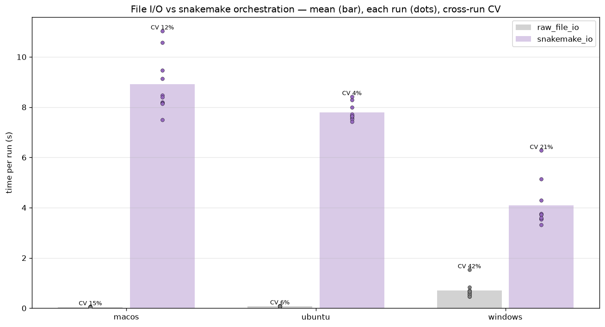

# I/O + snakemake results — is the file/orchestration layer the variance source?

_Data: io run, 30/30 legs green (3 OS × {3.12, 3.14} × 5 runs). Figure
auto-generated by CI (`plot_io.py`); narrative written by hand._

## Question

Prior experiments showed cellpose and suite2p-registration are stable within-OS,
leaving runner-luck on *compute* as the variance source. But the real pipeline
also spawns snakemake, walks a DAG, writes/reads intermediate files, and polls
with `--latency-wait`. Is *that* layer where the run-to-run variance lives?

## Result — no

Min-time, mean / cross-run CV / range over 10 runs per OS:

| bench | macOS | ubuntu | windows |
|---|---|---|---|
| **raw_file_io** (50 MB write+fsync+read) | 34 ms / 19% | 67 ms / 23% | **627 ms / 34%** (→ 1.2 s) |
| **snakemake_io** (3-rule DAG, trivial numpy) | 7.9 s / 11% | 7.5 s / **3%** | 3.5 s / 19% |

**snakemake orchestration is stable, not a variance carrier.** Its CV is 3–19%
(ubuntu tightest at 3%) — the same low-variance regime as cellpose and
registration, nowhere near the 5× same-leg blow-up. The file/DAG/latency-wait
layer is therefore **ruled out** as the variance source, reinforcing the
conclusion that the run-to-run variance is runner contention on the heavy
cellpose/torch compute.

## Two real side-findings (cost, not variance)

1. **snakemake has ~8 s of fixed overhead *per invocation*** for trivial work
   (7.5–7.9 s on macOS/ubuntu). Not variance, but real CI time — and the
   integration tests call `run_snakemake` several times per test × sessions. So
   "fewer snakemake calls / fewer sessions" (the fixture trim) helps here too.
2. **Windows disk I/O is 10–20× slower and noisy** (627 ms, CV 34%, up to 1.2 s
   vs ~50 ms elsewhere) — a Windows-runner filesystem trait. Small in absolute
   terms (<1.2 s vs 100 s compute), so a minor contributor at most.

## Where this leaves the investigation (all three experiments)

- **Compute (cellpose/torch):** the variance lives here — runner contention (PR #1/#2).
- **Registration (numba):** stable (PR #2).
- **File I/O + snakemake:** stable overhead, not a variance source (PR #3).

Single recommendation for photon-mosaic-pipeline #74: **trim the integration
fixture (fewer sessions → less compute *and* fewer snakemake calls); don't pin
threads.** ubuntu's slow attention kernel and Windows' slow disk are real but
secondary, mitigated by doing less work rather than fixed directly.
