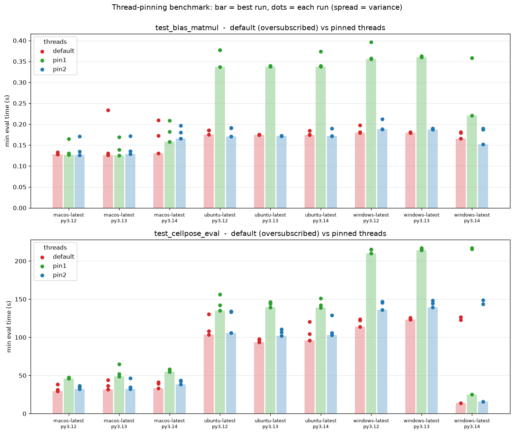

# Results — thread-pinning experiment

_Figure auto-generated by CI (`plot.py`); narrative written by hand. Companion
torch/suite2p diagnostics in `DIAGNOSTICS.md`._

Reproduce / aggregate:

```bash
gh run download <run-id> -D artifacts
python analyze.py artifacts      # tables
python plot.py artifacts         # bench_summary.png
```

## What we're looking for

| Signal | Where | Meaning |
|---|---|---|
| `default/pin1` ratio > 1, **within a job** | `analyze.py` table 1 | pinning is causally faster on the same runner → thread oversubscription is real |
| `pin1` cross-run CV ≪ `default` CV | `analyze.py` table 2 | pinning also stabilises runtime (the #74 variance) |
| `torch.num_threads == cpu_count`, BLAS == cpu_count | job log env banner | oversubscription is actually happening |
| `blas_matmul` shows the same pattern | both | BLAS alone reproduces it (not just torch) |

## Findings

### Local sanity run (1× macOS, 8-core, uncontended) — N=1

| workload | default | pin1 | pin2 |
|---|---|---|---|
| `cellpose_eval` | **54.1 s** | 116.5 s | 74.3 s |
| `blas_matmul` | 50.8 ms | 50.6 ms | 50.6 ms |

On a machine with spare cores and no noisy neighbour, **default (all threads) is
fastest and pinning is up to 2× slower** — parallelism just helps. The BLAS
matmul is unaffected (Apple Accelerate; may differ from OpenBLAS/MKL on the
linux runners).

**Implication:** "blanket-pin to 1 thread" is *not* a safe universal fix — it
would slow down any leg with cores to spare. The CI question is therefore about
**variance under contention**: does `default` swing wildly across runs while
`pin*` stays tight? That's what the matrix runs will show. The likely right fix
is a *moderate* pin (e.g. cores/2) and/or just the fixture trim, not pin1.

### CI matrix — 27/27 legs (3 OS × {3.12, 3.13, 3.14} × 3 runs), all green



cellpose mean (s) / cross-run CV:

| leg | default | pin1 | pin2 |
|---|---|---|---|
| macOS py3.12 | 33.1 / 12% | 47.0 / 1% | 34.5 / 5% |
| macOS py3.14 | 38.0 / 9% | 57.0 / 2% | 41.5 / 6% |
| ubuntu py3.13 | 95.8 / 1.8% | 143.3 / 2% | 106.5 / 3% |
| windows py3.14 | 87.7 / **59%** | 152.5 / 59% | 102.8 / 60% |

**1. Thread pinning is refuted.** `pin1` (1 thread) is slower on *every* one of
the 27 legs (`default/pin1` ≈ 0.56–0.81). On these 3–4 core runners parallelism
helps; starving cellpose to one thread just wastes cores. `pin2` ≈ `default`
speed. So there is no oversubscription to "fix" — the hypothesis is wrong.

**2. The variance is runner luck, not threads.** Within-OS run-to-run CV is low
(1–13%) almost everywhere; the exception is **windows py3.14**, whose three runs
were ~14 s, ~125 s, ~127 s (**CV 59%**) — and it hit `default`, `pin1` *and*
`pin2` equally, i.e. the whole job scaled with the runner, not with the thread
setting. That is the historical 5× same-leg blow-up, reproduced: **which physical
machine you land on (noisy-neighbour / hardware luck).**

**3. Cross-OS:** macOS (Apple Silicon) is fast+stable (~35 s); ubuntu is
systematically ~3× slower (~95–114 s); windows is fast-but-wildly-variable
(14–127 s). The *why* (ubuntu's slow attention kernel) is pinned down in the
companion diagnostics experiment — see `DIAGNOSTICS.md`.

## Conclusions (for photon-mosaic-pipeline #74)

- ❌ Don't pin threads — refuted on all 27 legs.
- ✅ The only real lever is **doing less work**: the integration-test fixture
  trim (fewer sessions → less cellpose) cuts the dominant cost on every leg and
  reduces exposure to the runner-luck variance.
- The run-to-run variance is partly irreducible (runner contention); the fixture
  trim mitigates it rather than eliminating it.
