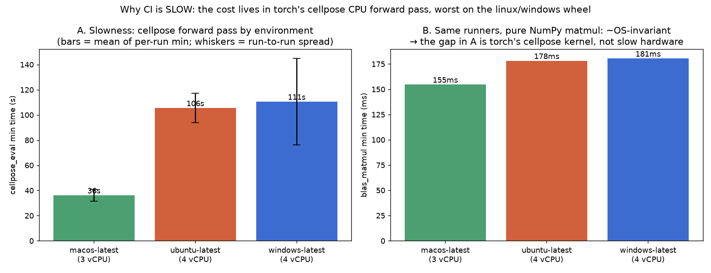
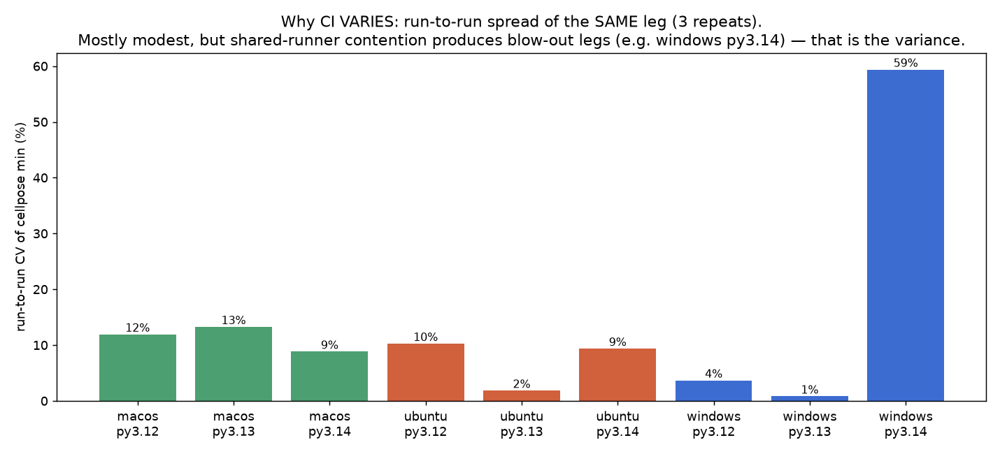
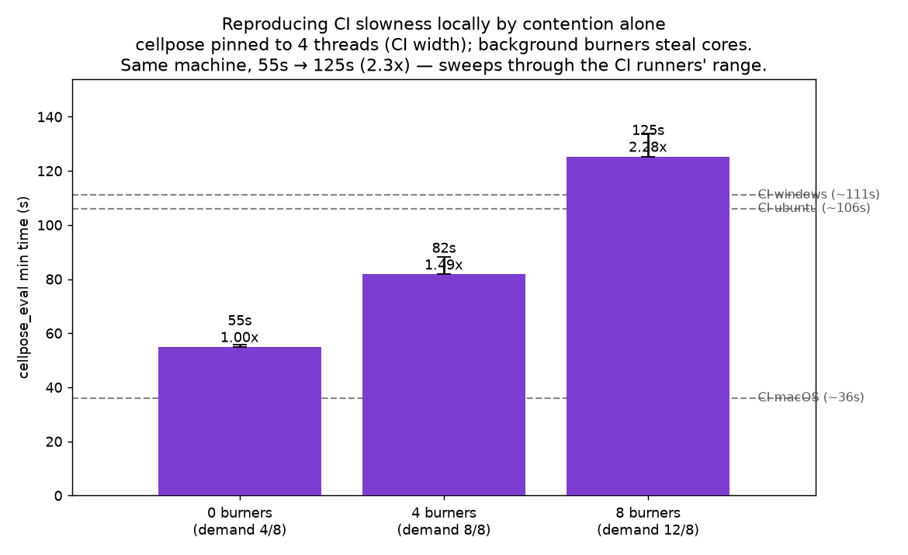

# Root cause of the photon-mosaic-pipeline CI slowness & variance

_What the three experiments (PRs #1–#3) + local re-runs show. Figures come from
the real CI results and from local runs on an 8-core Apple-Silicon Mac.
Reproduce with the commands at the end. Note: pip ships a **different prebuilt
torch for each operating system**, and each one contains different CPU math code
— so the same operation can run at very different speeds depending on the OS._

## Two causes, both supported by the data

| Symptom | Cause | Evidence |
|---|---|---|
| **Slow** — cellpose takes ~100 s on Linux/Windows vs ~36 s on macOS | the **torch package build for Linux/Windows** runs cellpose's CPU math ~3× slower than the macOS build | it's slow even on the *fastest* runs (nothing else running), and a plain NumPy matmul is equally fast on all three OSes → it's torch, not the hardware |
| **Variable** — the same CI job's time jumps around from run to run | **other jobs stealing CPU** on the shared runner | reproduced locally: adding background CPU load alone stretches cellpose from 55 s to 125 s |

The two are **separate and stack up**: each OS has a fixed *best-possible* time
set by its torch build, and CPU-stealing then makes any given run slower than
that best by a variable amount.

## 1. The slowness comes from torch's Linux/Windows build, not the hardware



cellpose forward pass, average of each job's fastest time:

| environment | cores | cellpose |
|---|---|---|
| macOS (CI) | 3 | **36 s** |
| Ubuntu (CI) | 4 | **106 s** |
| Windows (CI) | 4 | **111 s** |

The control on the right (Panel B) shows the cause: a **plain NumPy matmul** (raw
CPU math, none of torch's model code) takes **about the same time on every OS**
(155 / 178 / 181 ms). Same machines, same raw math, same speed. So the 3× gap on
the left is **specific to torch's cellpose math** on the Linux/Windows build (the
slow convolution/attention kernels PR #2 identified) — not slow hardware. Note
macOS even had *fewer* cores (3 vs 4) and still won, so it isn't about core count.

## 2. The variance comes from other jobs stealing CPU

Looking at each OS's **fastest** vs **slowest** run tells the two effects apart —
the fastest run is the one that got stolen from the least:

| OS | fastest run | slowest run | slowest ÷ fastest |
|---|---|---|---|
| macOS | 29.5 s | 44.1 s | 1.5× |
| Ubuntu | 93.5 s | 130.3 s | 1.4× |
| Windows | 14.1 s* | 126.4 s | 9× |

Two things this shows:
- **The 3× OS gap is still there even on the fastest runs** — fastest macOS
  29.5 s vs fastest Ubuntu 93.5 s is 3.2×. That's the torch build (§1), and it
  has nothing to do with CPU-stealing.
- **CPU-stealing hits macOS and Ubuntu about equally** (~1.5× vs ~1.4× from
  fastest to slowest). macOS isn't protected from it — it just starts from a
  time that's already 3× lower.

The `*` Windows `14.1 s` is one odd run out of three (that job's times bounced by
59%): an 8× swing is far more than CPU-stealing can explain (we measured stealing
maxing out around 2.3×, below) — that run simply landed on a **faster physical
machine**. Different physical machines in the shared pool + variable CPU-stealing
= the run-to-run variance.



_(The chart shows each job's run-to-run spread as a percentage. Most jobs are
1–13%; Windows-py3.14 spikes to 59% because of that one fast run.)_

**Reproduced locally.** On the idle Mac, limit cellpose to 4 cores (matching a CI
runner) and start background CPU-hogging processes ("burners") to steal cores:



| background load | total CPU demand | cellpose | vs idle |
|---|---|---|---|
| none (idle) | 4 of 8 cores | 55 s | 1.00× |
| 4 burners | 8 of 8 cores | 82 s | 1.49× |
| 8 burners | 12 of 8 cores | 125 s | **2.28×** |

CPU-stealing alone, on the same unchanged machine, stretches cellpose from 55 s
right up through the CI Ubuntu (~106 s) and Windows (~111 s) range. Steady load
gives a steady slowdown; in real CI the neighbouring jobs come and go, so the
slowdown varies from run to run — that's the variance.

## Recommendation for photon-mosaic-pipeline #74

**Trim the integration fixture** (fewer sessions → less cellpose compute). It's
the single lever that helps both problems at once: less time spent in the slow
kernel, and less time exposed to CPU-stealing. The Linux build's slow kernel is
the biggest *absolute* cost, but that's an upstream torch issue, not a bug in the
pipeline.

_(Ruled out earlier, not shown here — see `archive/`: pinning thread counts —
that only ever made it slower; file I/O + snakemake — steady, fixed overhead, not
a source of the variance.)_

## Reproduce

```bash
python -m venv .venv && .venv/bin/pip install -e .
mkdir -p local_artifacts

# run the cellpose/matmul benchmark locally
.venv/bin/pytest tests/test_thread_bench.py --benchmark-json=local_artifacts/bench-local.json

# stress test = imitate a busy CI runner: cap cellpose at 4 cores, steal the rest
.venv/bin/python stress_test.py --threads 4 --burners 0,4,8 --reps 3
.venv/bin/python plot_stress.py local_artifacts/stress.json --out rootcause_contention.png

# rebuild the CI figures from the downloaded results
gh run download <bench-run-id> -D artifacts   # figures in this doc used run 28460523531
.venv/bin/python plot_rootcause.py artifacts
```

- `--threads 4` imitates a 4-core runner; `--burners N` starts N background
  processes that each peg one core (the "neighbour" jobs). Once
  `threads + burners` is more than the machine's core count, you're being stolen
  from.
- To reproduce the *variance* (not just a steady slowdown), give it **on-and-off**
  load — start and stop burners between repeats; steady load only shifts the base
  time.
