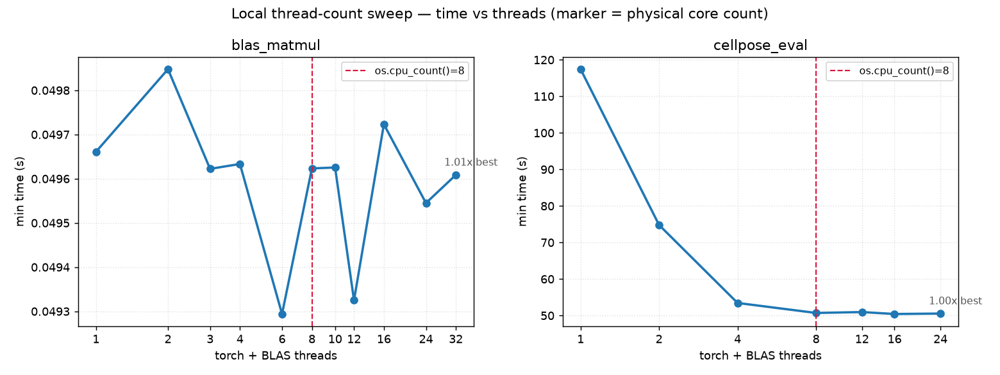

# Local replication — does the same picture hold off-CI?

_Machine: Apple Silicon, 8 physical cores (`os.cpu_count() = 8`), Python 3.12.9,
torch 2.12.1, numpy 2.4.6, cellpose 4.2.1.1. Reproduce with the commands at the
bottom. All numbers are `min` over repeats (same statistic CI headlines)._

The CI matrix can only compare 3 fixed thread settings on 3–4 core runners it
doesn't control. Locally we own an 8-core box, so we (a) re-ran the exact
pytest-benchmark suites and (b) **swept** the thread count past the core count —
the region CI can never reach — to draw the oversubscription curve directly.



## 1. Thread suite (same test as CI), 8-core Mac

| workload | default (8 thr) | pin1 (1 thr) | pin2 (2 thr) | default/pin1 |
|---|---|---|---|---|
| **cellpose_eval** (min) | **55.4 s** | 119.4 s | 76.9 s | **0.46** |
| **blas_matmul** (min) | 56.8 ms | 55.9 ms | 56.0 ms | 1.02 |

**Pinning threads makes cellpose ~2× slower**, same direction as CI
(default/pin1 was 0.5–0.8 across all runners). More threads help; nothing
thrashes. The oversubscription-thrashing hypothesis is refuted locally too.

## 2. Thread-count sweep (the part CI can't do)

cellpose_eval, min over 2 repeats:

| threads | 1 | 2 | 4 | 8 | 12 | 16 | 24 |
|---|---|---|---|---|---|---|---|
| min (s) | 117.4 | 74.8 | 53.4 | 50.7 | 51.0 | 50.4 | 50.5 |
| ×best | 2.33 | 1.48 | 1.06 | 1.01 | 1.01 | 1.00 | 1.00 |

The curve **falls steeply 1→4, saturates by ~4–8, then stays dead flat out to
24 threads on 8 cores** — a 3× oversubscription that costs *nothing*. This is the
cleanest possible refutation: even deliberately oversubscribing does not thrash
the cellpose forward pass on this hardware. The runtime is set by how many cores
you can actually use, not by contention between excess threads.

## 3. Two BLAS caveats worth knowing

- **On Apple Silicon the BLAS knob is a no-op.** `blas_matmul` is flat at
  ~49.6 ms from 1 to 32 threads because numpy uses Apple's Accelerate/vecLib,
  which `threadpoolctl` cannot throttle (AMX coprocessor). So *locally* BLAS
  shows no thread effect — but that's a measurement artifact of the backend, not
  evidence about oversubscription. On CI's Linux/Windows OpenBLAS the knob does
  bite (pin1 was ~2× slower than default there), which is the opposite sign from
  "pinning helps" — again pointing away from oversubscription as the problem.

## 4. I/O experiment (PR #3 topic), replicated + resource-swept

| bench | local (8-core Mac) | CI macOS (for reference) |
|---|---|---|
| **raw_file_io** (50 MB) | 52–88 ms | 34 ms |
| **snakemake_io** (3-rule DAG) | **6.55 s** | 7.9 s |

Resource sweeps:

- **snakemake wall-time vs `--cores` (1, 2, 4, 8): flat at ~6.55 s.** Handing
  the orchestrator more cores does nothing — the cost is fixed spawn/DAG
  overhead, not compute. The only lever is **fewer invocations** (the fixture
  trim), confirming PR #3's side-finding directly.
- **raw disk vs payload (10→400 MB): ~700–1400 MB/s, scales with size** but even
  400 MB is 0.33 s — negligible next to 50 s of compute.

## Bottom line

Local results agree with all three CI PRs and add the decisive missing piece:
**oversubscription is not the cause.** cellpose runtime is governed by usable
parallelism (saturates ~4–8 cores, flat beyond), and pinning threads only hurts.
The CI run-to-run variance is therefore runner contention on the heavy compute,
not a threading knob — so the fix is **do less compute** (trim the fixture /
fewer snakemake calls), not **pin threads**.

## Reproduce

```bash
python -m venv .venv && .venv/bin/pip install -e . snakemake

# 1. exact CI thread suite
.venv/bin/pytest tests/test_thread_bench.py --benchmark-json=local_artifacts/bench-local.json

# 2. thread-count sweeps (blas cheap, cellpose expensive ~20 min)
.venv/bin/python local_sweep.py --only blas     --threads 1,2,3,4,6,8,10,12,16,24,32 --repeats 5 --out local_artifacts/sweep_blas.json
.venv/bin/python local_sweep.py --only cellpose --threads 1,2,4,8,12,16,24          --repeats 2 --out local_artifacts/sweep_cellpose.json
.venv/bin/python plot_sweep.py local_artifacts/sweep_cellpose.json local_artifacts/sweep_blas.json --out local_sweep.png

# 3. I/O suite + resource sweeps (needs snakemake on PATH)
PATH="$PWD/.venv/bin:$PATH" .venv/bin/pytest tests/test_io_bench.py --benchmark-json=local_artifacts/io-local.json
PATH="$PWD/.venv/bin:$PATH" .venv/bin/python io_sweep.py
```
